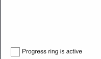

# Avalonia Progress Ring

This project is a simple progress ring for Avalonia that's modeled off of [ModernWpf's](https://github.com/Kinnara/ModernWpf) progress ring. Credit to ModernWpf for the initial code and design! v0.8.x works on Avalonia 0.9.x, and v0.9.x is compatible with Avalonia 0.10.x.



## Using in Your Project

Add `Deadpikle.AvaloniaProgressRing` to your NuGet references, then add the following to your `App.xaml` in `Application.Styles`:

```xml
<StyleInclude Source="avares://AvaloniaProgressRing/Styles/ProgressRing.xaml"/>
```

In your `UserControl`, add the following:

```xml
<UserControl xmlns="https://github.com/avaloniaui"
             xmlns:progRing="clr-namespace:AvaloniaProgressRing;assembly=AvaloniaProgressRing">
    <progRing:ProgressRing Width="80" 
                           Height="80"
                           IsActive="True"
                           HorizontalAlignment="Left"
                           VerticalAlignment="Top"
                           Foreground="Green"
                           Margin="10,20,0,0">
</UserControl>
```

Make sure that you bind to `IsActive` to show/hide the progress ring!

## Contributing

All contributions and improvements are welcome! Thanks for your involvement!

## License

MIT. Thanks!
