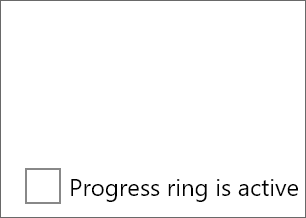
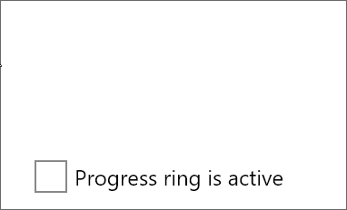

# Avalonia Progress Ring

This project is a simple progress ring for Avalonia that's modeled off of [ModernWpf's](https://github.com/Kinnara/ModernWpf) progress ring. Credit to ModernWpf for the initial code and design!

There are still improvements that could be made to make it more like the Windows progress ring (that can't fully be done in Avalonia 0.9.x due to lack of `Animation` `KeySpline`), but for now, this will be a solid start for an Avalonia progress ring.

**Note: The latest `master` version of Avalonia has the new `KeySpline` property on animation `KeyFrame` objects. This allowed us to mimic the ModernWpf progress ring almost exactly; so, whenever Avalonia 0.10 comes out, there will be an even better progress ring! See the feature/latest-avalonia branch for those changes.**

[](https://www.nuget.org/packages/Deadpikle.AvaloniaProgressRing/)
[](https://www.nuget.org/packages/Deadpikle.AvaloniaProgressRing/)
[](https://github.com/Deadpikle/AvaloniaProgressRing/issues)



**Progress ring on latest Avalonia (0.10 -- unreleased at this point):**



## Using in Your Project

Add `Deadpikle.AvaloniaProgressRing` to your NuGet references, then add the following to your `App.xaml` in `Application.Styles`:

```xml
<StyleInclude Source="avares://AvaloniaProgressRing/Styles/ProgressRing.xaml"/>
```

In your `UserControl`, add the following:

```xml
<UserControl xmlns="https://github.com/avaloniaui"
             xmlns:progRing="clr-namespace:AvaloniaProgressRing;assembly=AvaloniaProgressRing">
    
    <progRing:ProgressRing Width="80" 
                           Height="80"
                           IsActive="True"
                           HorizontalAlignment="Left"
                           VerticalAlignment="Top"
                           Foreground="Green"
                           Margin="10,20,0,0">
</UserControl>
```

Make sure that you bind to `IsActive` to show/hide the progress ring!

## Contributing

All contributions and improvements are welcome! Thanks for your involvement!

## License

MIT. Thanks!
