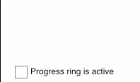

<div align="right">
  <details>
    <summary >🌐 Language</summary>
    <div>
      <div align="center">
        <a href="https://openaitx.github.io/view.html?user=Deadpikle&project=AvaloniaProgressRing&lang=en">English</a>
        | <a href="https://openaitx.github.io/view.html?user=Deadpikle&project=AvaloniaProgressRing&lang=zh-CN">简体中文</a>
        | <a href="https://openaitx.github.io/view.html?user=Deadpikle&project=AvaloniaProgressRing&lang=zh-TW">繁體中文</a>
        | <a href="https://openaitx.github.io/view.html?user=Deadpikle&project=AvaloniaProgressRing&lang=ja">日本語</a>
        | <a href="https://openaitx.github.io/view.html?user=Deadpikle&project=AvaloniaProgressRing&lang=ko">한국어</a>
        | <a href="https://openaitx.github.io/view.html?user=Deadpikle&project=AvaloniaProgressRing&lang=hi">हिन्दी</a>
        | <a href="https://openaitx.github.io/view.html?user=Deadpikle&project=AvaloniaProgressRing&lang=th">ไทย</a>
        | <a href="https://openaitx.github.io/view.html?user=Deadpikle&project=AvaloniaProgressRing&lang=fr">Français</a>
        | <a href="https://openaitx.github.io/view.html?user=Deadpikle&project=AvaloniaProgressRing&lang=de">Deutsch</a>
        | <a href="https://openaitx.github.io/view.html?user=Deadpikle&project=AvaloniaProgressRing&lang=es">Español</a>
        | <a href="https://openaitx.github.io/view.html?user=Deadpikle&project=AvaloniaProgressRing&lang=it">Italiano</a>
        | <a href="https://openaitx.github.io/view.html?user=Deadpikle&project=AvaloniaProgressRing&lang=ru">Русский</a>
        | <a href="https://openaitx.github.io/view.html?user=Deadpikle&project=AvaloniaProgressRing&lang=pt">Português</a>
        | <a href="https://openaitx.github.io/view.html?user=Deadpikle&project=AvaloniaProgressRing&lang=nl">Nederlands</a>
        | <a href="https://openaitx.github.io/view.html?user=Deadpikle&project=AvaloniaProgressRing&lang=pl">Polski</a>
        | <a href="https://openaitx.github.io/view.html?user=Deadpikle&project=AvaloniaProgressRing&lang=ar">العربية</a>
        | <a href="https://openaitx.github.io/view.html?user=Deadpikle&project=AvaloniaProgressRing&lang=fa">فارسی</a>
        | <a href="https://openaitx.github.io/view.html?user=Deadpikle&project=AvaloniaProgressRing&lang=tr">Türkçe</a>
        | <a href="https://openaitx.github.io/view.html?user=Deadpikle&project=AvaloniaProgressRing&lang=vi">Tiếng Việt</a>
        | <a href="https://openaitx.github.io/view.html?user=Deadpikle&project=AvaloniaProgressRing&lang=id">Bahasa Indonesia</a>
        | <a href="https://openaitx.github.io/view.html?user=Deadpikle&project=AvaloniaProgressRing&lang=as">অসমীয়া</
      </div>
    </div>
  </details>
</div>

# Avalonia Progress Ring

[](https://www.nuget.org/packages/Deadpikle.AvaloniaProgressRing/) [](https://www.nuget.org/packages/Deadpikle.AvaloniaProgressRing/) [](https://www.nuget.org/packages/Deadpikle.AvaloniaProgressRing/) [](https://github.com/Deadpikle/AvaloniaProgressRing/issues/)


This project is a simple progress ring for Avalonia that's modeled off of [ModernWpf's](https://github.com/Kinnara/ModernWpf) progress ring. Credit to ModernWpf for the initial code and design! v0.8.x works on Avalonia 0.9.x, and v0.9.x is compatible with Avalonia 0.10.x. v0.10.x is compatible with Avalonia 11 Preview 2+ (0.10.7+ builds on Avalonia 11.1+). v0.11.x is compatible with Avalonia 12 Preview 1.



## Using in Your Project

Add `Deadpikle.AvaloniaProgressRing` to your NuGet references, then add the following to your `App.xaml` in `Application.Styles`:

```xml
<StyleInclude Source="avares://AvaloniaProgressRing/Styles/ProgressRing.xaml"/>
```

In your `UserControl`, add the following:

```xml
<UserControl xmlns="https://github.com/avaloniaui"
             xmlns:progRing="clr-namespace:AvaloniaProgressRing;assembly=AvaloniaProgressRing">
    <progRing:ProgressRing Width="80" 
                           Height="80"
                           IsActive="True"
                           HorizontalAlignment="Left"
                           VerticalAlignment="Top"
                           Foreground="Green"
                           Margin="10,20,0,0"/>
</UserControl>
```

Make sure that you bind to `IsActive` to show/hide the progress ring!

## Contributing

All contributions and improvements are welcome! Thanks for your involvement!

## License

MIT. Thanks!
